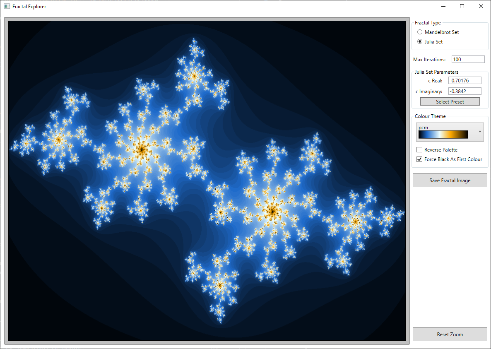

# Fractal Explorer implemented in C# #

This repository contains the code for a Fractal Explorer WPF application implemented in C#.  
 

### Prerequisites

- [.NET 6 SDK](https://dotnet.microsoft.com/en-us/download/dotnet/6.0)

 

### What does it do?

Implements functionality to view Mandelbrot and Julia set fractals (see https://en.wikipedia.org/wiki/Mandelbrot_set and https://en.wikipedia.org/wiki/Julia_set)  
Various settings can be modified to change the fractal image.  

 

### How to use the application
When the Fractal Explorer application is run, the UI appears as below:    

 

You can switch between working with Mandelbrot set and Julia set fractals by using the radio buttons in the "Fractal Type" group.  
The number of calculation iterations that are performed before reaching a critical "escape" condition determines the colour that is assigned to each pixel in the fractal image. The maximum value of the number of iterations that can be performed can be modified by changing the setting of the "Max Iterations" field. Changes to the maximum number of iterations affects the colour assigned to the pixels and also the overall granularity of the fractal image.  
  
When working with Julia set fractals, a few additional parameters can also be modified. The Julia set fractals generated by this application are calculated using the complex-valued polynomial function `p(z) = z² + c`, where c can have a real (cᵣₑ) and imaginary (cᵢₘ) element (so, for example, one of the presets built into the application is `-0.4 + 0.6i`; which corresponds to cᵣₑ = -0.4 and cᵢₘ = 0.6). The real and imaginary elements used for the c parameter in the polynomial function can be set by modifying the "c Real" and "c Imaginary" fields in the "Julia Set Parameters" group.  
The application also has a set of pre-defined settings for values of c; these can be selected by clicking on the "Select Preset" button in the "Julia Set Parameters" group.  
  
The application has a range of gradient colour themes that can be selected to change the pallete used for colouring the fractal image; these can be selected from the drop-down list in the "Colour Theme" group and the fractal image is immediately updated using the selected theme. The "Reverse Palette" checkbox can be used to reverse the order of the colours in the selected theme's palette. The "Force Black As First Colour" checkbox can be checked to force the first colour in the selected theme's palette to be black (which can sometimes yield an improved fractal image, particularly for the Mandelbrot set).  

The current fractal image can be saved to a file by clicking the "Save Fractal Image" button. The "Save As" dialog box that is then displayed allows one of five file types (i.e. image formats) to be selected - BMP, GIF, JPEG, PNG, or TIFF.

It is possible to zoom into sections of the fractal images by clicking within the image with the left mouse button and then dragging a rectangular box to select the zoom region (note that this rectangular box is restricted in order to maintain the fixed ratio of the original fractal image). It is also possible to zoom in and out using the mouse wheel. You can quickly return to the original complete (unzoomed) fractal image by clicking on the "Reset Zoom" button. 

### History

| Version | Details
|---:| ---
| 1.0.0 | Initial implementation of the Fractal Explorer WPF application.

